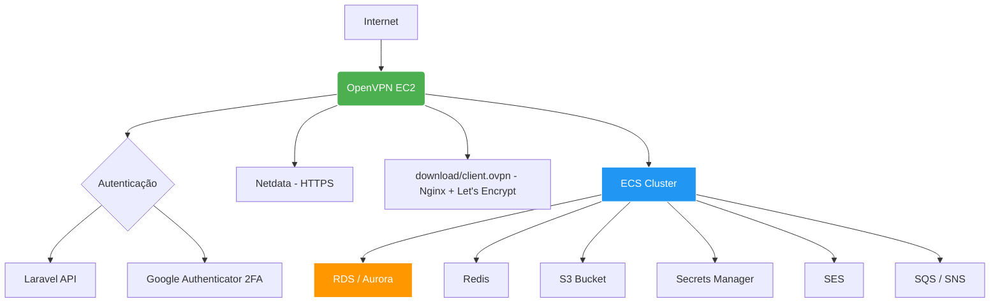

# 🧩 OpenVPN Server + Infraestrutura Segura na AWS

Este repositório contém a infraestrutura como código (**IaC**) para provisionar uma instância **EC2 do OpenVPN** totalmente configurada com os seguintes recursos:

- Servidor OpenVPN completo
- Autenticação via API Laravel
- 2FA com Google Authenticator
- HTTPS com Let's Encrypt
- Monitoramento com Netdata
- Proteção com Fail2Ban e UFW
- Atualizações automáticas
- Integração com Route53 para DNS dinâmico

A infraestrutura é criada usando **Terraform** na região **`sa-east-1` (São Paulo)** da AWS.

---

## 🌐 Diagrama da Arquitetura



---

## 🛠️ Tecnologias Utilizadas

| Ferramenta         | Descrição                                           |
| ------------------ | --------------------------------------------------- |
| **AWS**            | Ambiente de nuvem onde a infraestrutura será criada |
| **Terraform**      | Para infraestrutura como código (IaC)               |
| **OpenVPN**        | Servidor seguro de acesso à rede privada            |
| **Let’s Encrypt**  | Certificados SSL gratuitos                          |
| **Nginx**          | Proxy reverso e distribuição de cliente `.ovpn`     |
| **Fail2Ban & UFW** | Proteção contra tentativas maliciosas               |
| **Netdata**        | Monitoramento em tempo real dos recursos da máquina |
| **Route53**        | Gerenciamento de registros DNS                      |

---

## 🔐 Fluxo de Segurança

| Origem         | Destino            | Portas      | Protocolo |
| -------------- | ------------------ | ----------- | --------- |
| Internet       | OpenVPN (UDP 1194) | 1194        | UDP       |
| Seu IP Público | SSH (22)           | 22          | TCP       |
| Internet       | HTTPS (443)        | 443         | TCP       |
| Internet       | HTTP (80)          | 80          | TCP       |
| OpenVPN        | ECS                | Dinâmico    | TCP       |
| ECS            | RDS                | 5432 / 3306 | TCP       |
| ECS            | Redis              | 6379        | TCP       |

---

## 📦 Estrutura do Projeto

```
app-o8partners-terraform/
│
├── main.tf                 # Definições principais (provider, data sources)
├── variables.tf            # Declaração das variáveis
├── outputs.tf              # Saídas importantes (IPs, ARNs, URLs)
├── providers.tf            # Configuração do provider AWS
├── install_openvpn.sh      # Este é o script que vai rodar na EC2
├── README.md                # Documentação do projeto
├── modules/
│   ├── vpc/                # Cria VPC, subnets, route tables, IGW
│   ├── security-groups/    # Define todos os grupos de segurança
│   ├── openvpn/            # Cria EC2 OpenVPN + configura rede
│   ├── ecs/                # Cluster ECS, task definitions, services
│   ├── rds/                # Banco de dados RDS/Aurora
│   ├── redis/              # Redis (ElastiCache ou Redis standalone)
│   ├── s3/                 # Cria buckets S3
│   ├── secrets-manager/    # Armazena credenciais sensíveis
│   ├── ses/                # Configura envio de e-mails
│   ├── sns-sqs/            # Filas e notificações
│   └── ...                 # Outros módulos conforme necessário
│
└── terraform.tfvars        # Valores específicos para o ambiente (prod, dev)
└── docs/                    # Opcional: documentação adicional e prompts
     └── openvpn-context.md  # Seu prompt salvo
```

---

## 🧱 Componentes da sua infraestrutura

| Recurso                             | Descrição                                   |
| ----------------------------------- | ------------------------------------------- |
| **EC2 OpenVPN**                     | Servidor que dará acesso seguro à VPC       |
| **ECS (Elastic Container Service)** | Rodará seus containers (ex: APIs, serviços) |
| **RDS / Aurora**                    | Banco de dados relacional                   |
| **Redis**                           | Cache ou fila em memória                    |
| **S3**                              | Armazenamento de arquivos                   |
| **Secrets Manager**                 | Armazenamento seguro de senhas, tokens etc. |
| **SES**                             | Envio de e-mails                            |
| **SQS**                             | Filas assíncronas                           |
| **SNS**                             | Notificações                                |
| **VPC**                             | Rede privada onde tudo vai rodar            |

---

## 🔧 Parte 1: O que está no Script Bash?

Ele é um **script automático de instalação do OpenVPN com muitas funcionalidades extras**. Ele faz **tudo em um só lugar**:

### 📌 Principais Funcionalidades do Script

| Etapa                                                | O que ele faz                                                                                        |
| ---------------------------------------------------- | ---------------------------------------------------------------------------------------------------- |
| **1. Atualização do Sistema**                        | Atualiza pacotes e instala dependências essenciais (OpenVPN, certbot, fail2ban, nginx, netdata etc.) |
| **2. Configuração de Rede Otimizada**                | Ajusta parâmetros do kernel Linux para melhorar desempenho de rede (ideal para AWS)                  |
| **3. Geração de Certificados (PKI)**                 | Cria autoridade certificadora (CA), certificados para servidor e chaves seguras                      |
| **4. Configuração do OpenVPN**                       | Cria o arquivo `server.conf` com configurações avançadas de segurança e performance                  |
| **5. Autenticação via API Laravel**                  | Faz integração com sistema externo para autenticar usuários                                          |
| **6. Autenticação 2FA (Google Authenticator)**       | Adiciona segunda camada de segurança para acesso ao VPN                                              |
| **7. Firewall e Segurança (UFW + Fail2Ban)**         | Bloqueia IPs após tentativas falhas                                                                  |
| **8. Servidor Web para Download do Cliente `.ovpn`** | Oferece cliente configurado via HTTPS                                                                |
| **9. HTTPS com Let's Encrypt**                       | Protege os sites com certificado SSL gratuito                                                        |
| **10. Atualizações Automáticas**                     | Mantém o sistema atualizado sozinho                                                                  |
| **11. Reinicialização dos Serviços**                 | Garante que tudo esteja funcionando após a instalação                                                |
| **12. Arquivo README**                               | Mostra instruções pós-instalação                                                                     |

---

## 🧠 Como funciona a autenticação?

O script usa **autenticação customizada via API Laravel**, ou seja:

- O usuário digita login e senha no cliente OpenVPN.
- O script envia as credenciais para uma API (`https://api.o8partners.com.br/vpn/auth `)
- Se a resposta for `{ "success": true }`, o acesso é liberado.
- Pode exigir também **2FA** se a API retornar `"2fa_required": true`.

---

## 🔐 Como funciona o 2FA?

- Usa o plugin PAM do OpenVPN + Google Authenticator.
- Cada usuário precisa rodar o script `setup-2fa.sh` para gerar um código QR.
- Depois, no cliente `.ovpn`, há a linha `static-challenge "Código 2FA" 1` para pedir o token TOTP.

---

## 📦 Onde o cliente baixa o `.ovpn`?

A URL será:

```
https://vpn.o8partners.com.br/download/client.ovpn
```

Tem proteção por **autenticação básica (htpasswd)** — o usuário precisa digitar um login/senha HTTP antes de baixar o arquivo.

---

## 📊 E o monitoramento?

O script instala **Netdata**, que mostra métricas em tempo real da máquina, e o disponibiliza em:

```
https://netdata.vpn.o8partners.com.br
```

Também protegido por autenticação HTTP.

---

## ✅ Resumo: O que esse script faz?

Este script automatiza a criação de um **servidor OpenVPN robusto**, com:

- Alta performance (BBR, tuning de rede)
- Segurança (2FA, firewall, fail2ban)
- Integração com sistemas externos (API Laravel)
- HTTPS (Let's Encrypt)
- Monitoramento (Netdata)
- Atualizações automáticas

---

## 🚀 Como Usar

### 1. Clone o repositório

```bash
git clone https://github.com/seu-usuario/app-o8partners-terraform.git
cd app-o8partners-terraform
```

### 2. Configure as variáveis no arquivo `terraform.tfvars`

```hcl
key_name           = "seu-par-de-chaves"
allowed_cidr       = "seu-ip-publico/32"
route53_zone_id    = "Z0XXXXXXXXXXXXXX"
```

> Substitua pelos valores reais antes de executar o Terraform.

---

## 🛠️ Passos para Instalar o Terraform

O Terraform é uma ferramenta de código que você roda no terminal (CLI).

### ✅ No Ubuntu/Linux:

```bash
# Baixe o Terraform
wget -O- https://apt.releases.hashicorp.com/gpg  | sudo gpg --dearmor -o /usr/share/keyrings/hashicorp-archive-keyring.gpg
echo "deb [signed-by=/usr/share/keyrings/hashicorp-archive-keyring.gpg] https://apt.releases.hashicorp.com  $(lsb_release -cs) main" | sudo tee /etc/apt/sources.list.d/hashicorp.list
sudo apt update && sudo apt install terraform
```

### ✅ No Mac (Homebrew):

```bash
brew tap hashicorp/tap
brew install hashicorp/tap/terraform
```

### ✅ No Windows (via Chocolatey):

```powershell
choco install terraform
```

### ✅ Após a instalação, verifique:

```bash
terraform version
```

> Deve mostrar algo como: `Terraform v1.x.x`

---

## 🚀 Execute os comandos do Terraform

```bash
terraform init
terraform plan
terraform apply
```

> Confirme com `yes` quando solicitado.

---

## 📋 Após a execução

O Terraform irá:

- Criar uma VPC com subnet pública
- Provisionar uma instância EC2 Ubuntu com OpenVPN configurado
- Associar um IP elástico à instância
- Configurar registros DNS no Route53:
  - `vpn.o8partners.com.br`
  - `netdata.vpn.o8partners.com.br`
- Aplicar certificados SSL via Let's Encrypt
- Garantir segurança com firewall e autenticação

---

## 📎 Instruções Pós-Criação

- **Acesse o cliente `.ovpn`:**

  ```
  https://vpn.o8partners.com.br/download/client.ovpn
  ```

  - Usuário: `admin`
  - Senha: `SUA_SENHA_AQUI` _(definida no script)_

- **Acesse o monitoramento Netdata:**

  ```
  https://netdata.vpn.o8partners.com.br
  ```

  - Usuário: `admin`
  - Senha: `SUA_SENHA_AQUI`

- **Para ativar o 2FA:**
  ```bash
  sudo setup-2fa.sh
  ```

---

## 🧹 Limpeza (quando quiser remover tudo)

```bash
terraform destroy
```

> Confirme com `yes`.

---

## 📝 Como usar

sudo su
chmod +x install_openvpn.sh
./install_openvpn.sh

---

## 💬 Suporte e Contribuição

Se tiver dúvidas, problemas ou melhorias para sugerir, fique à vontade para abrir uma issue ou pull request.

---

## ✅ Créditos

Desenvolvido por **Alisson Carneiro**  
Contato: alisson.carneiro@comitt.com.br  
Versão: 1.0.0  
Licença: MIT
